# Smart Fish Pond Management System

The frontend is built with **Next.js**, the backend with **Node.js/Express**, and the microcontroller firmware is written in **C++** (Arduino/ESP32).

## How to Run

***Note:** Below instruction is for running the system locally on your computer. To actually implement the system and accessing it from the internet, you will need to host your frontend, backend and database in public servers.*

### Part 1: Prerequisites

Make sure you have:

- A computer to run the backend and frontend.
- An **ESP32** microcontroller with the sensors and actuators already wired up.
- The table below shows which ESP32 pin connects to each component's data pin.

| Component | ESP32 Pin |
|---|---|
| Feeder motor's Relay Module's data pin | `23` |
| Oxygen motor's Relay Module's data pin | `22` |
| Servo motor data pin | `21` |
| Temperature sensor data pin | `4` |
| pH sensor data pin | `34` |
| Turbidity sensor data pin | `33` |
| Rain sensor data pin | `32` |

- A Wi-Fi router that both the computer and the ESP32 can connect to (the ESP32 only supports **2.4GHz** Wi-Fi, not 5GHz).
- Note: The ESP32 and computer needs to be connected to same WiFI when running the system locally. But if you hosted your backend on a public server, so that it can be accessed from the internet, then only the ESP32 needs to be connected to a WiFi.
- Clone the repository from https://github.com/JUST-CSE-15-IoT-Group-2/smart-fish-pond-management-system, or download and extract the project zip file, and remember the location.

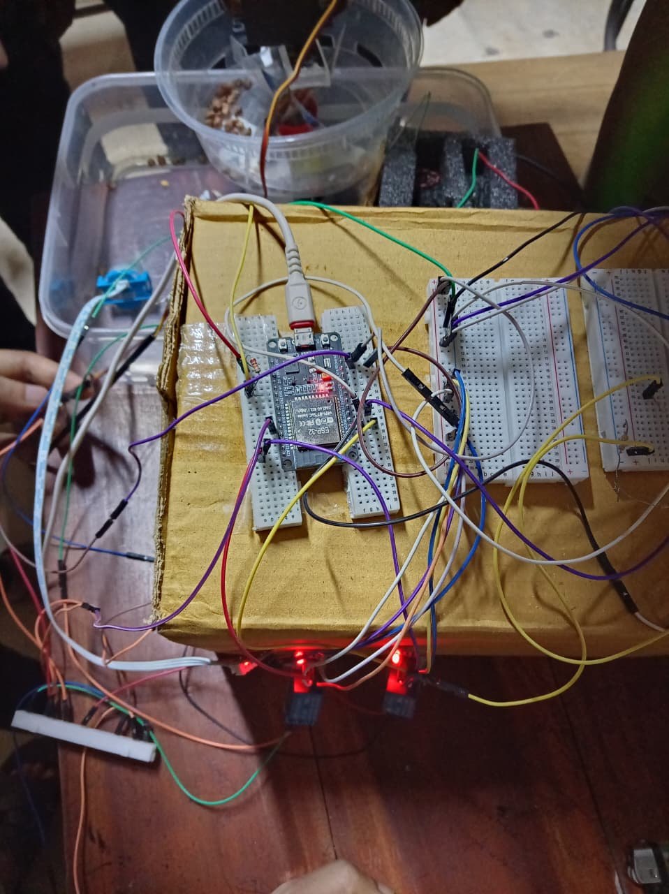

*Figure 1: Hardware Setup.*

### Part 2: Setting Up the Backend

The backend is the program that stores your pond's data and talks to both the ESP32 and your dashboard.

- Install **Node.js** and **MongoDB** on the computer.
- From the project folder, open the `backend` folder and create a `.env` file with necessary values. The format is explained in `.env.example` file in `backend` folder.
- Open a terminal in `backend` folder and type `npm install`. This will install all required packages.
- Start the backend by entering `npm run dev` command in the same terminal. Once running, it will print a message showing it is live and reachable on your network. It will also show which port the backend is running on (e.g. **Port: 5000**). Note that.
- Also note the computer's local network IP address (find it with `ipconfig` on Windows or `ifconfig`/`ip addr` on Mac/Linux); the ESP32 and frontend will use this address with the backend's port number to reach the backend.
- Note: The above instruction is for running the system locally. If you want to access the system from internet, host the backend on a public server with a public IP address or domain instead, and use that IP address and port number or domain in frontend and ESP32.

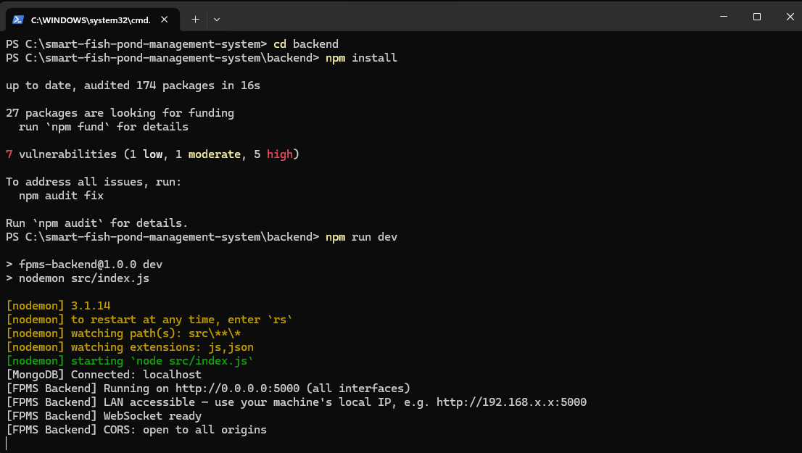

*Figure 2: Backend Setup.*

Keep this computer and the backend program running at all times. If it stops, your dashboard will lose its live connection and the ESP32 will not be able to send readings or receive commands.

### Part 3: Setting Up the ESP32

The ESP32 is the microcontroller that is physically connected to your sensors and actuators.

- Install and open **Arduino IDE**. You will need to go to **Sketch → Include Library → Manage Libraries** and install the following libraries.

| Library Name | Manufacturer |
|---|---|
| Arduinojson | Benoit Blanchon |
| DallasTemperature | Miles Burton |
| ESP32Servo | Kevin Harrington, John K. Bennet |
| OneWire | Jim Studt, Tom Pollard and others |

- Go to **Tools → Board → Boards Manager** and install **esp32** by Espressif Systems.
- In Arduino IDE, go to **Files → Open**, then a file manager window will appear. In that window go to the project folder. Then from the project folder go to `esp32/esp_code` folder and open `esp_code.ino` file.
- Then go to **Tools → Board → esp32** and choose **ESP32 Dev Module**.
- In the code, edit the value of `WIFI_SSID` global variable as your WiFi name, and `WIFI_PASSWORD` as your WiFi password.
- Similarly edit the value of `BACKEND_IP` as your backend IP address, and the value of `BACKEND_PORT` as your backend port number (the backend IP address and port number you noted in Part 2).
- Note: If you hosted your backend in a public server, use your public IP address and port number or domain.
- Upload the code to the ESP32 using a USB cable.
- Once the starting process completes and it shows in the terminal **"Hard resetting via RTS pin..."**, go to **Tools → Serial Monitor** in the Arduino IDE, then a section will appear in the bottom. That is the serial monitor. In the serial monitor there should be baud rate drop down menu. From the baud rate drop down menu, choose **115200**. Now, you should see it join your Wi-Fi network and begin printing sensor readings every few seconds.

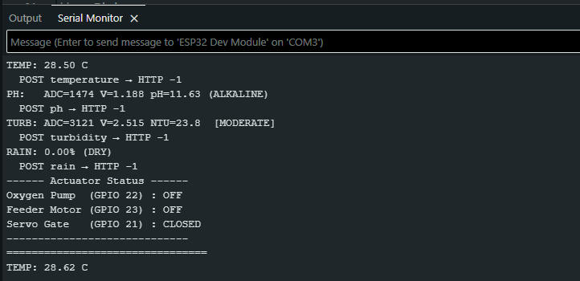

*Figure 3: ESP 32 Setup.*

If the ESP32 cannot find your Wi-Fi, double check the network name is typed exactly right and that your router is broadcasting on the 2.4GHz band.

### Part 4: Setting Up the Frontend Dashboard

- From the project folder, open the `frontend` folder.
- In that folder, create a `.env.local` file with your own values. The format in explained in `.env.local.example` file in `frontend` folder.
- Open a terminal in the `frontend` folder.
- Enter command `npm install` in the terminal.
- Enter command `npm run dev` in the same terminal. This runs the frontend on your computer. You will see the site address in the terminal once the frontend runs (e.g. `http://localhost:3000`). Open that in your browser and you will see the landing page.
- From the landing page, log in using the id password that you set on your backend `.env` file.
- Note: If you want to access the frontend from the internet, you will need to host the frontend on a public server.

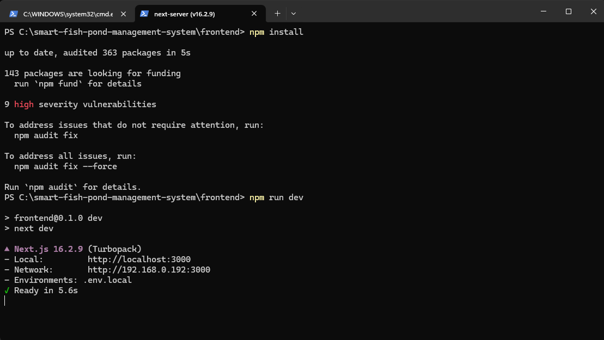

*Figure 4: Frontend Setup.*

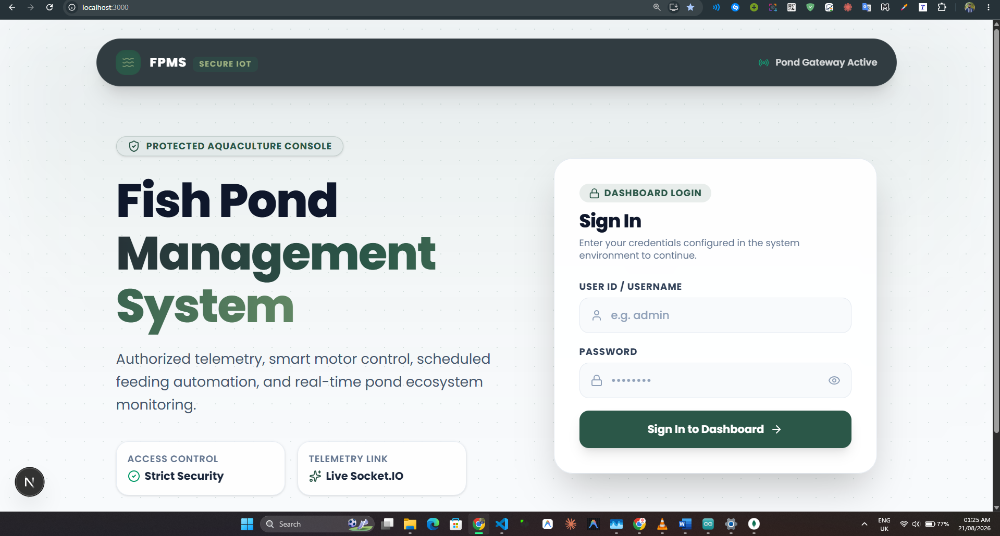

*Figure 5: Landing Page.*

Once logged in, you will land on your dashboard, ready to monitor and control your pond.

## How to Use

### Part 5: Understanding the Dashboard

The dashboard has four main sections, reachable from the side menu.

#### Updates

This is your live view of the pond. You will see four cards showing water temperature, pH level, turbidity (clarity), and rainfall, all updating automatically as new readings arrive. Below the cards are trend charts so you can see how conditions have changed over recent readings. If a reading moves outside a safe range, the card will change color and you may also get a push notification on your device.

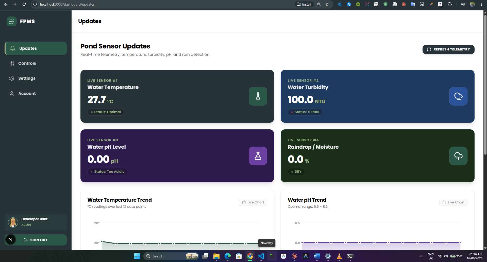

*Figure 6: Updates menu from Dashboard.*

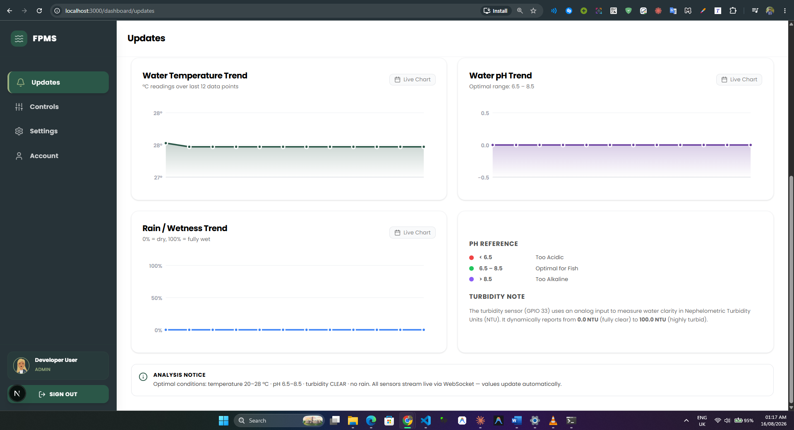

*Figure 7: Updates menu from Dashboard - 2.*

#### Controls

This is where you manage your feeder and oxygen motor.

- **Feeding schedule:** add or remove times of day when the feeder should run automatically, and set how many minutes it runs each time.
- **Manual mode:** turn on manual mode to take direct control of the feeder, then use the on and off button to feed your fish whenever you like, instead of waiting for the schedule.
- **Oxygen motor:** turn the motor on or off. The motor will automatically turn on if rain meter detects more 40% rain and vice versa. User can adjust this from **Settings**.
- **Connection link:** if you ever need to stop all automatic actions immediately, you can sever the connection here. This safely shuts everything down until you reconnect it.

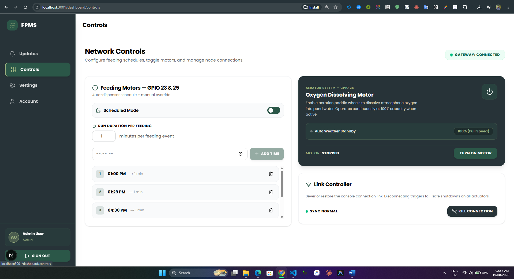

*Figure 8: Controls menu from Dashboard.*

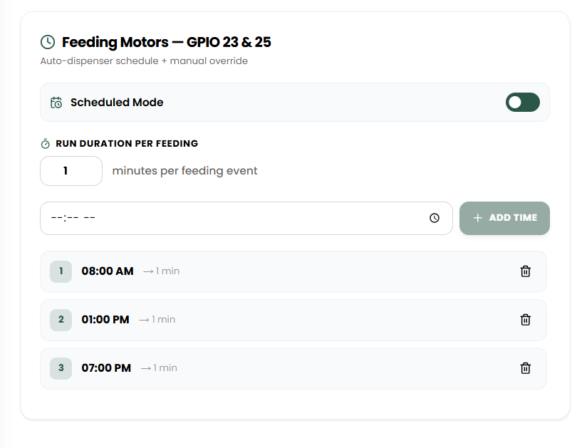

*Figure 9: Feeding motor schedule control.*

#### Settings

Here you can set the safe ranges for temperature, rain and pH. If a reading goes above or below these limits, the system will treat it as a warning and can alert you. The Rain sensor threshold will also be used for automatically turning on/off the oxygen motor. You can also turn on push notifications from this page so you get alerts even when the dashboard is closed.

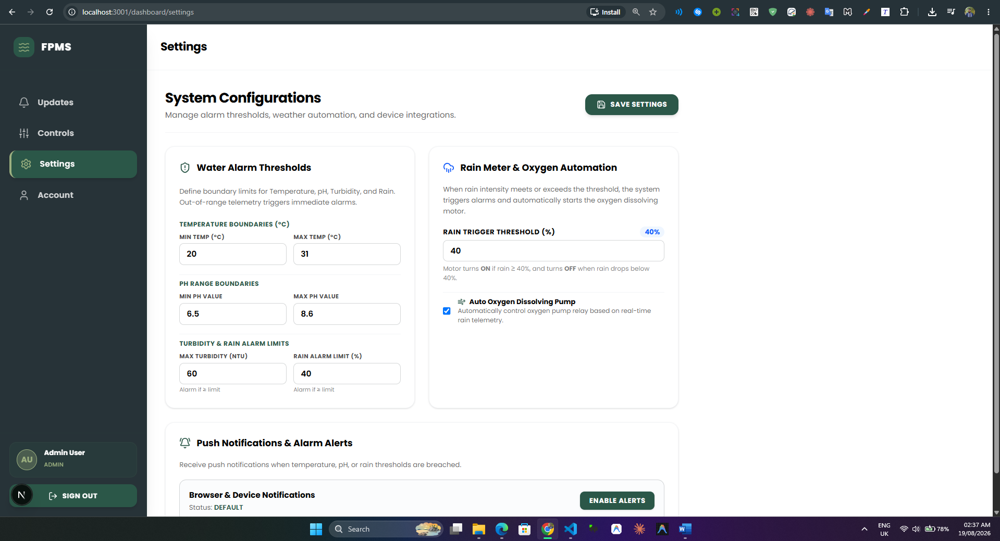

*Figure 10: Settings Configuration.*

#### Account

This shows your profile information and a personal access key.

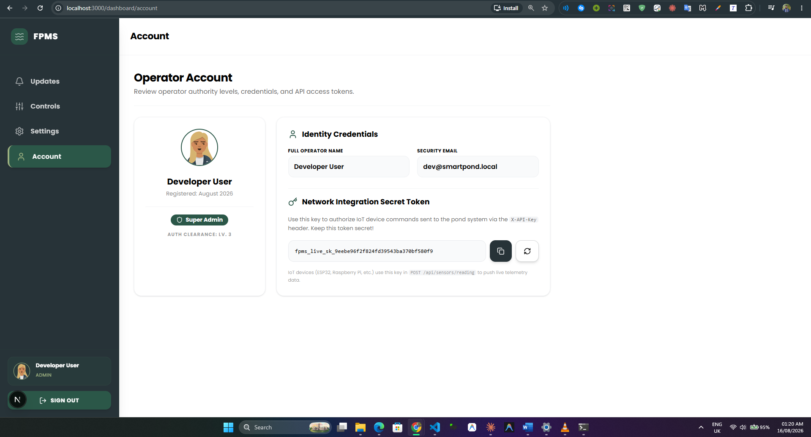

*Figure 11: Account settings.*

### Part 6: Everyday Use

Once everything is set up, using the system day to day is simple.

- Check the **Updates** page whenever you want a quick look at your pond's condition.
- Let the feeding schedule run on its own, or switch to manual mode.
- Keep the oxygen motor running automatically based on rain, or you can switch it on/off manually.
- If you get a push notification about a warning, open the app and check the **Updates** page to see what triggered it.

### Part 7: Simple Troubleshooting

**No new readings showing up:** Check that your server computer is turned on and the backend is running. Also check that the ESP32 is powered and connected to Wi-Fi.

**Feeder or oxygen motor not responding:** Make sure the connection link on the **Controls** page is not switched off. If it is, reconnect it.

**Not receiving notifications:** Make sure notifications are allowed for the dashboard in your phone or browser settings, and that you enabled alerts from the **Settings** page.

**ESP32 will not connect to Wi-Fi:** Confirm the Wi-Fi name and password in the firmware are correct, and that your router is on the 2.4GHz band, since the ESP32 cannot connect to 5GHz networks.

## Conclusion

The project successfully built a working system that lets fish farmers monitor and control their pond remotely. It reads key water conditions, shows them live on a dashboard, and gives direct control over feeding and aeration, both scheduled and manual. Push notifications close the loop between detecting a problem and the user knowing about it. The biggest missing pieces are offline alerting and local schedule storage on the ESP32, and these should be the next priorities. Overall, the system proves that an affordable, locally deployable pond monitoring solution is achievable, and with the identified improvements, it has a clear path toward becoming a dependable tool for small and mid sized fish farms.
